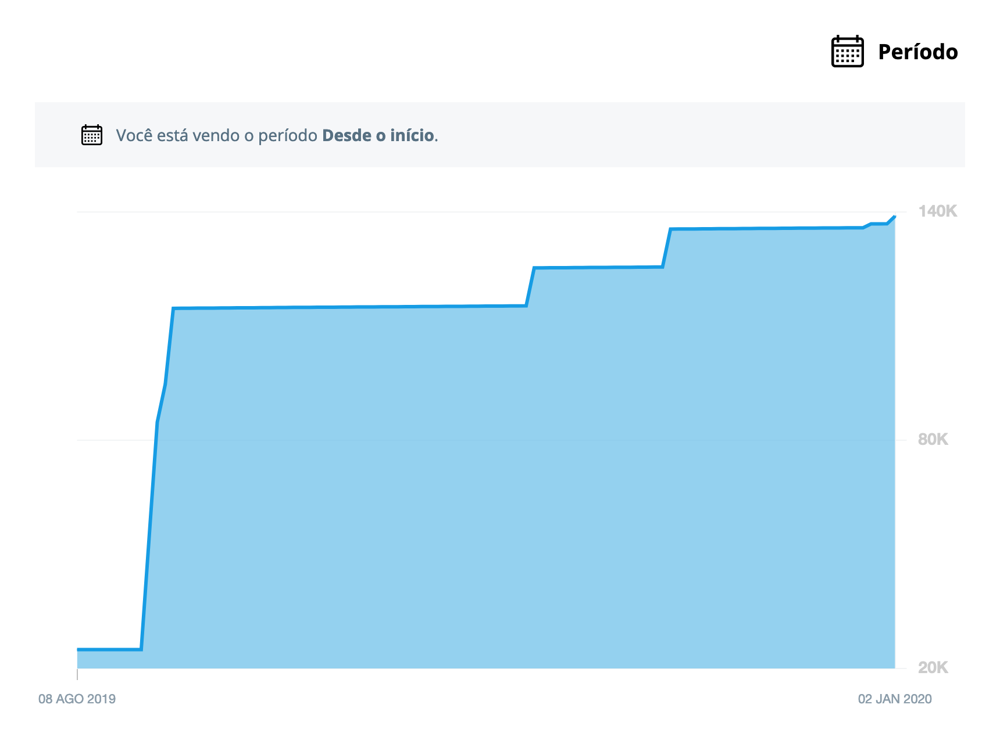

## Investments Chart

### Visão geral
Este é um projeto exemplo feito em React. Foram criados testes unitários e testes de integração usando Jest e Enzyme. Redux e Redux Persist foram utilizados para ter manter um estado global da aplicação e persistir os dados, respectivamente. A lib de gráficos utilizada foi o Chart.js.

## Scripts

**Pré-requisito: É necessário ter a última versão LTS do Node.js instalado.**

No diretório do projeto, você pode executar:

### `yarn start`

Executa o aplicativo no modo de desenvolvimento. 
Abra [http://localhost:3000](http://localhost:3000) para visualizá-lo no navegador.

A página será recarregada se você fizer edições. 
Você também verá erros de lint no console.

### `yarn test`

Executa os testes em modo de exibição interativa. 
Consulte a seção sobre [running tests](https://facebook.github.io/create-react-app/docs/running-tests) para obter mais informações.

### `yarn build`

Cria o aplicativo para produção na pasta `build`.  
Ele agrupa corretamente o React no modo de produção e otimiza a construção para obter o melhor desempenho.

Consulte a seção sobre [deployment](https://facebook.github.io/create-react-app/docs/deployment) para obter mais informações.

## Como contribuir
Ao contribuir com este repositório, primeiro discuta a alteração que deseja fazer via problema, email ou qualquer outro meio com os proprietários deste repositório antes de fazer uma alteração.

### Processo de Pull Request
1. Certifique-se que não haja nenhum erro ao executar ou buildar o projeto e que todos os testes automatizados estejam executados com sucesso.
2. Atualize o README.md com detalhes das alterações relevantes para a execução e manutenção do projeto.
3. Você poderá fazer merge do Pull Request quando tiver a aprovação de dois outros desenvolvedores ou, se você não tiver permissão para fazer isso, poderá solicitar ao segundo revisor que faça o merge para você.
